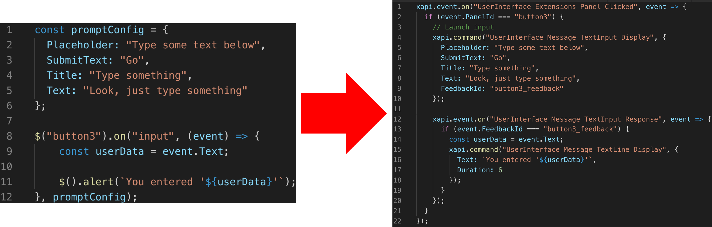

# sugar

For the impatient, just go here: **[quickstart.md](./quickstart.md)**

```md
    8 8                                                                 
 ad88888ba   88        88    ,ad8888ba,         db         88888888ba   
d8" 8 8 "8b  88        88   d8"'    `"8b       d88b        88      "8b  
Y8, 8 8      88        88  d8'                d8'`8b       88      ,8P  
`Y8a8a8a,    88        88  88                d8'  `8b      88aaaaaa8P'  
  `"8"8"8b,  88        88  88      88888    d8YaaaaY8b     88""""88'    
    8 8 `8b  88        88  Y8,        88   d8""""""""8b    88    `8b    
Y8a 8 8 a8P  Y8a.    .a8P   Y8a.    .a88  d8'        `8b   88     `8b   
 "Y88888P"    `"Y8888Y"'     `"Y88888P"  d8'          `8b  88      `8b  
    8 8                                                                                                                    
```

Syntactic $ugar for customizing collab hardware (experimental software)


----------

## What is $ugar?

In short, $ugar lets you write this:



$ugar isn't a library, it's a bit of so-called [syntactic "$ugar"](https://en.wikipedia.org/wiki/Syntactic_sugar) for the incredible [JSXAPI](https://www.npmjs.com/package/jsxapi) [library](https://github.com/cisco-ce/jsxapi)

## How I "install" $ugar?

There are no build/setup steps or dependencies for $ugar-- just copy the [library.js](library.js) (or [library_min.js](library_min.js)) file and paste it in the bottom of your macro

Make sure your macro has this dependency: ```const xapi = require('xapi');```

## Examples

See the [examples directory](./examples) for some sample user-interfaces and associated macro code to handle interactivity

See the [docs directory](./docs) for a listing of helpers and other functions

### Ex. Action Button handler

```js
$('button1').on('click', (event) => {
  // In here you can invoke other methods, post to a web service, etc 
  $().call('joe@cisco.webex.com');  // initiate webex call
});
```

### Ex. Input Box (tap a button, bring up input box then do something with input)

```js
$('button2').on('input', (event) => {
  console.log(event); // event: { id: '1', FeedbackId: '__button2', Text: 'bongo' }
  const userData = `You entered ${event.Text}!`;
  $().alert(userData);
});
```

### Ex. Widget 

```js
$('widget_id').on('widget_action', (event) => {
    console.log("#", event);
    // { id: '1', WidgetId: 'widget_id', Value: '2', Type: 'pressed' }
    // { id: '1', WidgetId: 'widget_id', Value: '2', Type: 'released' }
});
```

Also lots of various utility helpers (ex ```$().alert```, ```$().buildPrompt```, ```$().startTimer```), see more in the [API Reference](./docs/sugar_reference.md)

## Useful Resources + References

* Macros 101: https://help.webex.com/en-us/np8b6m6/Use-of-Macros-with-Room-and-Desk-Devices-and-Webex-Boards

* https://www.cisco.com/c/dam/en/us/td/docs/telepresence/endpoint/ce95/macro-scripting-tutorial.pdf

* https://www.cisco.com/c/dam/en/us/td/docs/telepresence/endpoint/ce93/collaboration-endpoint-software-api-reference-guide-ce93.pdf

* Lots of configuration guides: https://www.cisco.com/c/en/us/support/collaboration-endpoints/spark-room-kit-series/products-installation-and-configuration-guides-list.html

* https://github.com/CiscoDevNet/awesome-xapi

* https://github.com/cisco-ce/jsxapi

* https://www.youtube.com/watch?v=TSP0e5rXUl8