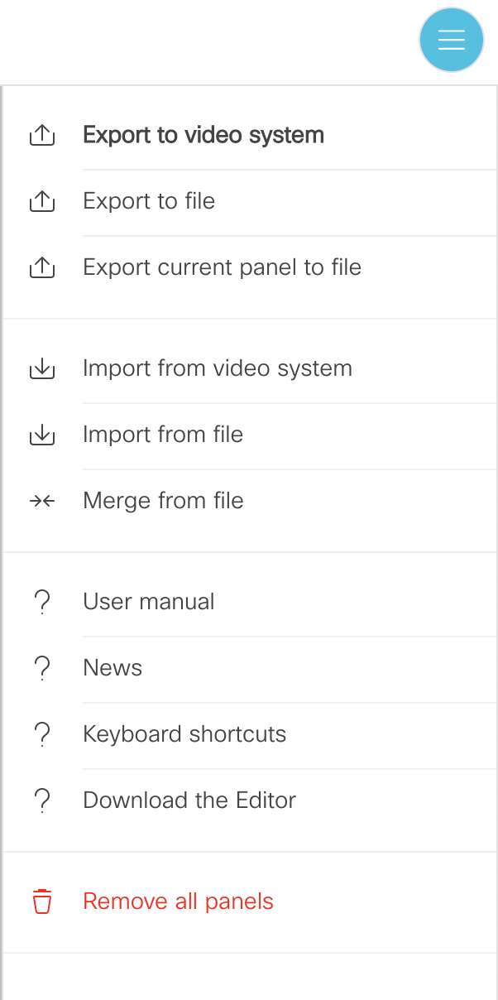

## Setup

To run the examples in this repo (and later deploy your own) on your own device, you will need three things...

* A certified WebEx device that is connected to the internet  (or a [sandbox](https://devnetsandbox.cisco.com/RM/Topology?c=37ab87fa-8dc5-4667-b461-0e7dab07176b))

* A machine on the same network as the WebEx device

* Either administrator or "integrator" credentials and can login to the device ([see here](https://help.webex.com/en-us/jkhs20/Local-User-Administration-on-Room-and-Desk-Devices) for details)

## Experimenting w/ an example

### 1) Saving/loading interfaces

Each example directory in this repo contains an ```interface.xml``` file which specifies which panels & widgets to add to your device

You have two options for importing the ```interface.xml``` file from your codec's web menu:



* **Option 1:** "Import from file": 1st make a backup of your existing interface, load the ```interface.xml``` file by selecting "import from file." This will clear everything on the device besides defaults and your new interface. When you're done experimenting, import your existing interface to get rid of any changes

* **Option 2:** "Merge from File": This will mix the new user-interface elements with the items already present on your device

### 2) Load the code

In each example folder ther are two macro files:

1) ```index.js``` (the example using jsxapi)

2) ```index_sugar.js``` (the example using $ugar)


## Common Errors

## 1) xapi import

```
unknown: Identifier 'xapi' has already been declared (10:6)
```

**Explanation:** This means that the xapi library has been imported twice in your macro (this can happen if you copy/paste into a macro that already has the import.)

**Resolution:** Make sure this line only appears once in your macro: `const xpi = require('xapi');`

## 2) Too many, too few, or just plain incorrect parameters

```js
'Unhandled promise rejection' { code: 4, message: 'Invalid or missing parameters' }
```

**Explanation:** This means you have passed incorrect or too few parameters to a function.

Ex. The `$().alert` helper function takes a message to display and an optional configuration parameter

Add superfluous or mispelled or incorrect case

```js
$().alert("My important message", { X: 1400, Y: 755 }); // Works

$().alert("My important message", { X: 1400, Y: 755, extra: "hi!" }); // Error

$().alert("My important message", { X: -1400, Y: 755 }); // Error because X must be 0 - 10000, see docs
```

**Resolution:** Consult xcommand API documentation check spelling and number of parameters


Other tips:

- Case matters-- the difference between `event.Text` & `event.text` or `event.FeedbackId` vs `event.Feedbackid`