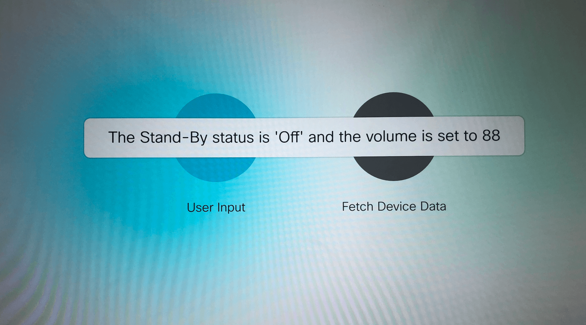

## Description

Lots of buttons that display text and query the device volume/state + a widget that logs to your macro console 

As you'll see in later examples, you can take user input and do something with it like dispatch to webservices

## Setup

To try on your device, copy & paste ```index_sugar.js``` into your macro editor and import the ```interface.xml``` file in the "UI Extensions Editor." For specifics, see the ["Running the Examples" Guide in the docs directory](../../docs/running-the-examples.md)

## Files

* [index_sugar.js](index_sugar.js)

* [index.js](index.js): 

* [interface.xml](interface.xml) (see **[instructions for loading interface components on your device](../../docs/running-the-examples.md#experimenting-w-an-example)**)


## Diagram/Screenshots



