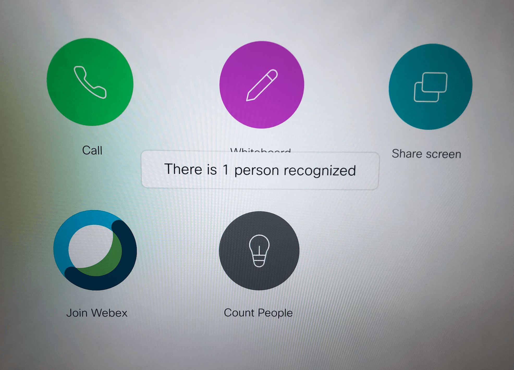

## Description

Tap a button and display the number of people recognized by the camera in the room

## Setup

To try on your device, copy & paste ```index_sugar.js``` with the $ugar library (see the [docs](../docs/running-examples.md)

## Files

* [index_sugar.js](index_sugar.js)

* [index.js](index.js): 

* [interface.xml](interface.xml) (see **[instructions for loading interface components on your device](../../docs/running-the-examples.md#experimenting-w-an-example)**)


## Diagram/Screenshots


