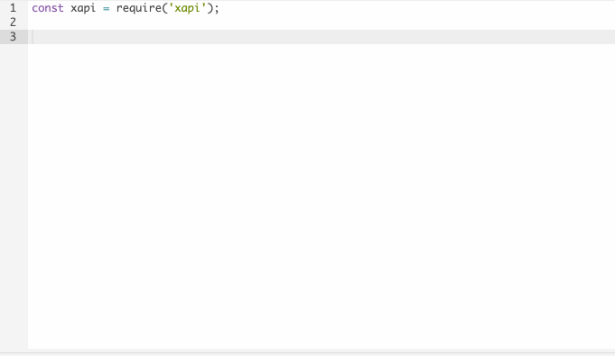

## $ugar Quickstart

The *really* quick quickstart:

1) Copy & paste **[library.js](./library.js)** (or **[library_min.js](./library_min.js)**) into your macro editor



2) Add in some $ugar (below a click handler which logs its event and shows an alert)

```js
$('button1').on('click', (event) => {
    console.log('#', event); // event: { id: '1', PanelId: 'button1' }
    $().showAlert('You tapped button 1!');
});
```

See some [examples](./examples)

See [API Reference](./docs/sugar_reference.md)